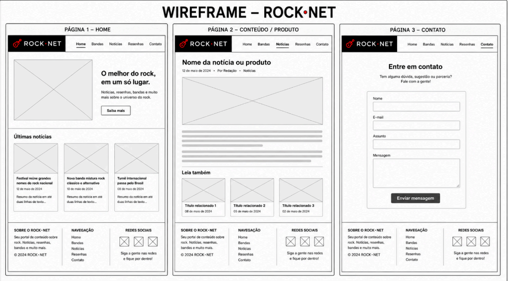

# Requisitos do Sistema
NOTAS DE ESTUDO

ETAPA 1 – Pesquisa Conceitual & Escopo de Software

O que faz com que um Projeto de Software seja diferente de um Script ou Código isolado?

Um Projeto de Software é algo muito mais amplo e estruturado. Antes de começar a trabalhar no código, é necessário fazer um planejamento detalhado para definir exatamente o que será desenvolvido, quais ferramentas serão utilizadas e como o trabalho será realizado. Normalmente, um Projeto de Software envolve várias etapas, documentação, testes e pode ser trabalhado por mais de uma pessoa.

Já um Script ou Código isolado é um programa simples, criado para resolver uma tarefa específica. Ele não requer um planejamento tão detalhado e geralmente é menor e mais rápido de desenvolver.

Ciclo de Vida Básico de um Projeto

Levantamento de Requisitos / Escopo

Nessa etapa, a equipe se reúne com o cliente para entender exatamente o que ele precisa. Depois disso, é definido o que fará parte do Projeto de Software e o que não será desenvolvido.

Desenvolvimento / Codificação

É a fase em que os programadores começam a criar o sistema, escrevendo o código e desenvolvendo todas as funcionalidades que foram planejadas.

Testes / Qualidade

Depois que o sistema é desenvolvido, são feitos testes para verificar se tudo está funcionando corretamente. Se forem encontrados erros, eles são corrigidos antes da entrega do Projeto de Software.

Entrega / Implantação

Quando o Projeto de Software está pronto e funcionando, ele é entregue ao cliente ou publicado para que os usuários possam utilizá-lo.

Alinhamento com a NovaWeb Studio

Definir um escopo antes de começar a programar é muito importante porque ajuda a equipe a saber exatamente o que deve ser feito. Assim, evita mudanças de última hora, diminui o retrabalho e facilita o cumprimento dos prazos do Projeto de Software. Com um bom planejamento, o Projeto de Software fica mais organizado e as chances de atraso são bem menores.

# ROCK.NET

## Descrição do Projeto

O ROCK.NET é um blog voltado para fãs de rock e heavy metal, com conteúdos sobre bandas, álbuns, músicas, notícias e curiosidades.

O projeto busca criar um site organizado, de fácil navegação e com uma identidade visual relacionada ao gênero musical.

## Objetivo

Desenvolver um blog utilizando HTML, CSS e JavaScript, aplicando conceitos de planejamento, organização de projetos, UX/UI e desenvolvimento web.

## EAP - Estrutura Analítica do Projeto

| Etapa | Atividade | Situação |
|---|---|---|
| 1 | Definição do tema do projeto | Concluído |
| 2 | Definição das páginas | Concluído |
| 3 | Criação do Wireframe | Concluído |
| 4 | Definição da identidade visual | Concluído |
| 5 | Organização das pastas | Concluído |
| 6 | Documentação do projeto | Concluído |
| 7 | Desenvolvimento em HTML | Próxima etapa |
| 8 | Desenvolvimento do CSS | Próxima etapa |
| 9 | Implementação do JavaScript | Próxima etapa |
| 10 | Testes e correções | Próxima etapa |

## Cronograma

| Etapa | Atividade |
|---|---|
| Planejamento | Definição do tema e objetivo do projeto |
| Prototipação | Desenvolvimento do Wireframe |
| Design | Definição das cores e tipografia |
| Organização | Criação da estrutura de arquivos e pastas |
| Documentação | Organização do README |
| Desenvolvimento | Criação das páginas em HTML |
| Estilização | Desenvolvimento do CSS |
| Funcionalidades | Implementação do JavaScript |
| Finalização | Testes e correções |

## Wireframe

O Wireframe apresenta a estrutura planejada para as páginas do ROCK.NET.

## Identidade Visual

A identidade visual utiliza:

- 60% Preto
- 30% Branco
- 10% Vermelho

Tipografia:

- Títulos: Bebas Neue
- Textos: Roboto

## Tecnologias Utilizadas

- HTML
- CSS
- JavaScript
- Git
- GitHub
- Visual Studio Code

## Status do Projeto

A etapa inicial de planejamento e documentação foi concluída. O projeto está organizado para iniciar a fase de desenvolvimento.
